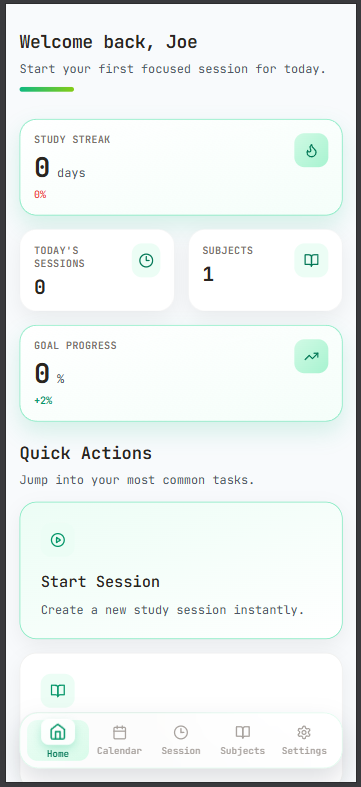
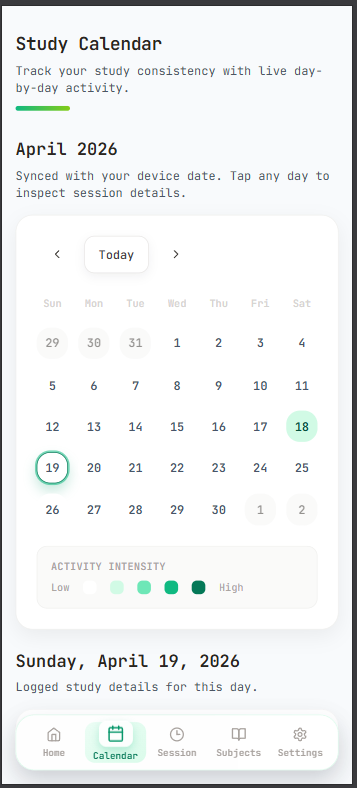
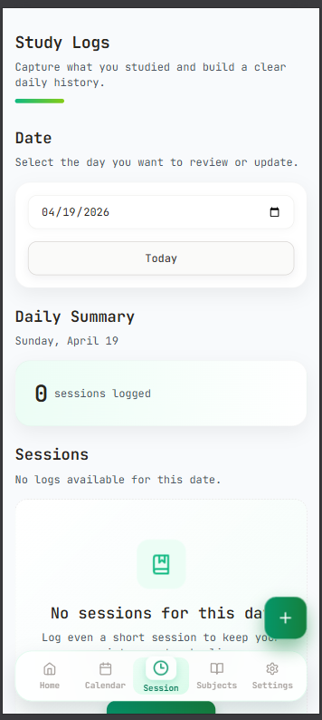

# StudyTrack - Student Workspace & Study Tracker(Only For Android)

A modern, beautiful web application built for students to organize study materials, track daily learning activities, and visualize progress through an interactive calendar heatmap.

## Features

### 📚 **Dashboard**
- Personalized greeting with the user's name
- Study streak counter with motivational messages
- Daily summary cards (sessions, duration, subjects)
- Recent activity feed
- Quick access to continue studying
- Daily goals progress tracker

### 📁 **Subject Workspace**
- Create and manage subjects (DSP, Math, Chemistry, etc.)
- Upload and organize PDF files
- Tag files for easy categorization (Exam, Important, Notes, Chapter 1, etc.)
- Color-coded subject cards
- File management with delete functionality
- Responsive grid layout

### 📅 **Study Calendar**
- GitHub-style activity heatmap
- Visual intensity indicators showing study activity levels
- Click to view detailed logs for any date
- Monthly view with navigation
- Activity statistics (total sessions, active days)
- Responsive design for all screen sizes

### 📝 **Daily Study Log**
- Add, edit, and delete study logs
- Track study duration (in hours)
- Link logs to specific subjects
- Add notes and reflections
- Organize logs by date
- Auto-logging of activities

### 🎯 **Activity Tracking**
- Study streak system to maintain motivation
- Daily goals setting and progress tracking
- Session counting
- Auto-logging of file operations
- Historical data preservation

### 🎨 **UI Features**
- Soft pastel color palette (green, beige, white, subtle gradients)
- Smooth animations with Framer Motion
- Rounded cards with soft shadows
- Glassmorphism effects
- Floating Action Button (FAB) for quick actions
- Bottom navigation for mobile
- Sidebar navigation for desktop
- Fully responsive (mobile-first design)

### 🎭 **Mascot**
- Cute animated book character with graduation cap and glasses
- Idle floating animation
- Blinking eyes
- Celebration animation on milestones
- Interactive hover states

### 💾 **Data Storage**
- Local-first localStorage persistence
- Automatic data backup on every change
- No login required - works completely offline
- Data structure optimized for performance

  
  
  

